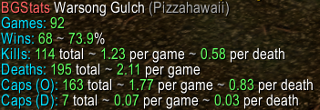

# BGStats

An addon for WoW 1.12.1 that records and calculates battleground statistics for your character.



## Install

1. Download [latest version](https://github.com/Pizzahawaiii/BGStats/archive/refs/heads/main.zip).
2. Extract `BGStats-main` to your <WoW>/Interface/AddOns folder.
3. Rename `BGStats-main` to `BGStats`.

## Use

Use the following commands in-game to show your stats for individual battlegrounds:

```
/bgs wsg
/bgs ab
/bgs av
```

Or use `/bgs all` to show your overall stats for all battlegrounds combined.

## Limitations

The addon only records your stats whenever a battleground ends with one of the factions winning, which has a few implications:

1. It doesn't record any stats if you leave the BG early.
2. It doesn't record any stats if the BG ends because there's not enough players.
3. Joining a BG late somewhat messes up your stats. If the BG ends 10 seconds after you join, all your "per game" stats will probably be dragged down a bit, obviously depending on how many games the addon has recorded so far already.

## Contribute

If you face any problems or have general suggestions, please create [an issue](https://github.com/Pizzahawaiii/BGStats/issues) or contact me in-game.

Any code contributions and improvements are welcome. Just fork the repo and create a pull request.

## Author

Pizzahawaii @ [RetroWoW](https://retro-wow.org)